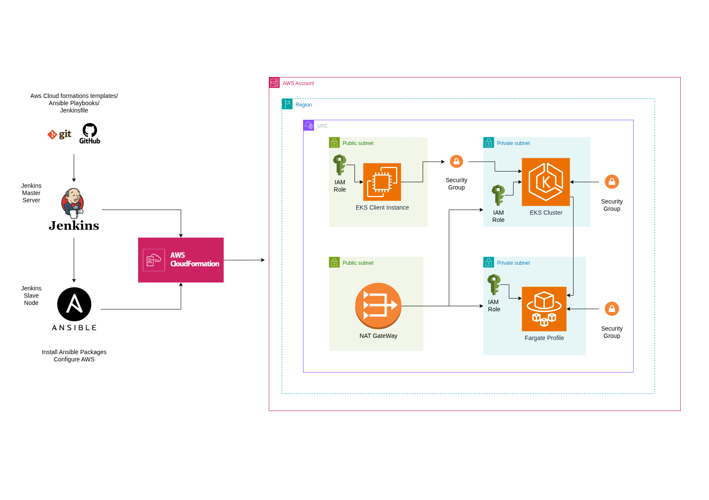

# 🚀 EKS Fargate Cluster in Private Subnets (with EC2 Access)

This repository provisions a private 🎯 Amazon EKS Cluster with Fargate profiles using CloudFormation, accessible only via an EC2 bastion host. Deployment is automated through Ansible and Jenkins CI/CD.

---

## 🧰 Technologies Used

- 🏗️ **CloudFormation**: VPC, EKS Cluster, Fargate profile, EC2, IAM
- 🤖 **Ansible**: Automation of stack deployment
- 🔁 **Jenkins**: CI/CD pipeline
- 🧠 **kubectl + Helm**: Installed in EC2 for Kubernetes operations

---

## 🧱 Architecture

> ✅ GitHub → Jenkins → Ansible Agent → AWS CloudFormation → EKS Cluster Provisioning

---

## 🎯 Typical Use Case

You'd use this stack when you want:

✅ A secure, private-only EKS cluster for production or dev  
✅ Minimal operational overhead using Fargate (no node groups)  
✅ An EC2 jumpbox (bastion host) to control and interact with your EKS cluster (no VPN required)  
✅ A fully reproducible and infrastructure-as-code-based deployment pipeline

---

## 📝 High-Level Purpose

This CloudFormation stack creates:

- 🌐 A custom VPC with public and private subnets across two AZs  
- ☁️ An EKS Cluster running on Fargate (no EC2 workers)  
- 🛡️ A bastion EC2 instance to interact with EKS via `kubectl`  
- 🔐 IAM roles, security groups, and routing infrastructure  
- 📤 Output values for automation: EKS cluster name, EC2 instance ID, and public IP

---

## 🔩 Main Components

### 🔹 1. Networking Layer (VPC & Subnets)
- 🧱 **VPC**: DNS enabled
- 🌍 **Subnets**: 2 public + 2 private across AZs
- 🔗 **Internet/NAT Gateways** for egress
- 🧭 **Route Tables** for subnet traffic routing

---

### 🔹 2. Security & Access
- 🔐 **Security Groups**
  - `InstanceSecurityGroup`: SSH access (port 22)
  - `EKSClusterAdditionalSecurityGroup`: Port 443 from EC2 to EKS control plane

- 👤 **IAM Roles**
  - `EC2AdminRole`: Admin access for EC2
  - `EKSClusterRole`: Cluster operations
  - `FargateProfileRole`: For pod execution

---

### 🔹 3. EKS Cluster & Fargate Profile
- 🧠 **EKS Cluster**
  - 🔒 Private endpoint only
  - 📝 Logging: `api`, `audit`
  - 🛡️ Linked to private subnets and SGs

- 🎯 **Fargate Profile**
  - Schedules pods in: `default`, `kube-system`, `aws-observability`, etc.

---

### 🔹 4. EKS Client EC2 Instance
- 💻 **In public subnet** with internet access
- ⚙️ Installs:
  - `kubectl` 🧠
  - `helm` 📦
- 🔐 Uses `EC2AdminRole` to manage EKS cluster
- 🔄 Can generate `kubeconfig` for private EKS cluster access

---

### 🔹 5. Outputs
Upon successful stack creation, the following are printed:

✅ **EKSClientInstanceId** — Bastion EC2 ID  
✅ **EKSClientPublicIP** — Use to SSH into EC2  
✅ **EKSClusterName** — For kubeconfig generation and scripting

---

## 🛠️ Jenkins Pipeline

### 📜 Jenkins Deployment Logs

---

## 📡 AWS CNF Stack Status

### 🗺️ VPC Resource Map

---

## ☸️ EKS Cluster View

### 🧑‍💻 EKS Client Instance

### 🔐 Access EKS Cluster from EC2

---

📌 *Feel free to fork, deploy, and customize for your AWS Kubernetes needs!*
